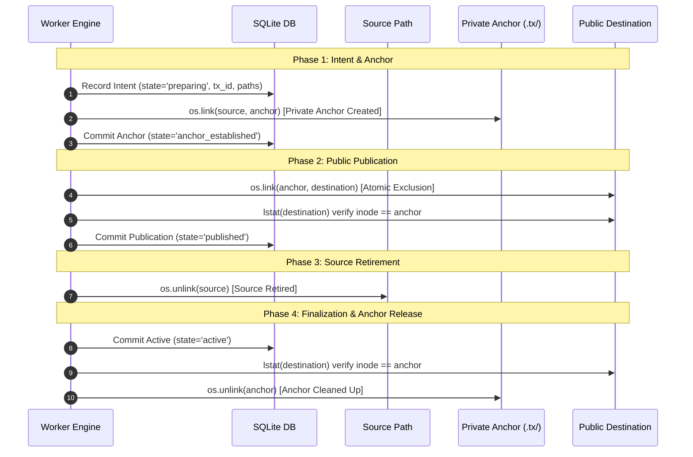
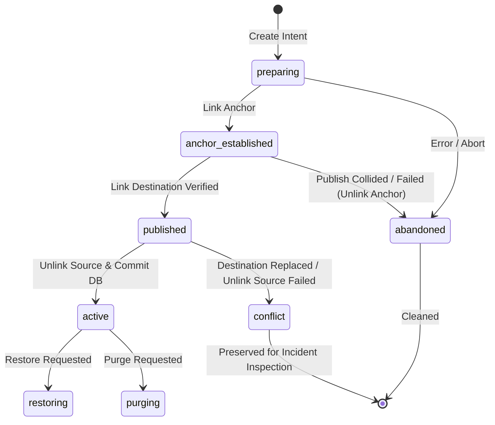

# NAS File Center v0.3.5 — Gate5-G / G7 Architecture Freeze Amendment
# zfuse-compatible Persistent Mutation Transaction Architecture

**Document Version:** 1.0.0  
**Date:** 2026-09-11  
**Status:** ARCHITECTURE FREEZE AMENDMENT PROPOSAL / NOT IMPLEMENTED  
**Baseline HEAD:** `c32d0778c59add81e0c296d6f73aa66bc403c04f`  
**Target Platform:** 极空间 NAS (ZSpace OS, Linux amd64, Docker, `zfuse.zfsv3`)  
**Authority:** Explicit Architecture Design Authorization (Option B + Option A Fallback)  
**Implementation Status:** IMPLEMENTATION NOT AUTHORIZED — SPECIFICATION ONLY  

---

## A. Problem Statement & Historical Progression

NAS File Center v0.3.5 implements a strict mutation lifecycle:
```text
Preview → Explicit Generate Draft → Freeze → Validate → Execute
```
Under Gate5-E and Gate5-G, deduplication mutations require moving duplicate files into a designated quarantine directory on the same filesystem before eventual purge or restore. 

Prior releases relied on kernel-level atomic no-replace renaming (`renameat2(..., RENAME_NOREPLACE)` on Linux, `renameatx_np(..., RENAME_EXCL)` on macOS Darwin). However, on 极空间 NAS (ZSpace) with the proprietary `zfuse.zfsv3` FUSE filesystem, `renameat2(RENAME_NOREPLACE)` is rejected by the driver with `errno 22 (EINVAL)`.

A sequence of three hotfixes attempted to implement userspace emulation inside `app/fs_ops.py`:
1. **G7-hotfix1**: Attempted `link()` + `unlink()`. Probing failed on real NAS due to non-existent probe path bypassing the FUSE driver.
2. **G7-hotfix2**: Corrected capability probing using disposable existing objects. Real-NAS validation then reached the fallback code, revealing race vulnerabilities.
3. **G7-hotfix3**: Independent code review identified blind destination deletion on error (Blocker A) and destination replacement before source unlink (Blocker B). Patched with `lstat` pre-checks.
4. **G7-hotfix4**: Independent review and formal analysis proved that `lstat(destination)` followed by `unlink(source)` is fundamentally vulnerable to **Time-of-Check to Time-of-Use (TOCTOU)** races against concurrent namespace writers, and symlink `readlink()` text equality cannot prove ownership.

Because userspace system calls cannot hold kernel directory locks across calls, **a pure `fs_ops` single-operation abstraction cannot satisfy the zero-data-loss, no-overwrite, and no-false-success contract on `zfuse`**. 

This amendment establishes a **Persistent Two-Phase Mutation Transaction Architecture** backed by a **Private Recovery Anchor** and **Reconciliation Engine**, providing verifiable linearizability and crash safety across publication and source retirement.

---

## B. Real-NAS Telemetry and Authoritative Evidence

Testing on target 极空间 NAS hardware under Docker established the following immutable baseline facts:
1. **Physical Mount Topology**: `/workspace/data` and `/workspace/quarantine` reside on the same underlying `zfuse.zfsv3` volume (`st_dev` is identical).
2. **Ordinary Rename**: `os.rename(src, dst)` succeeds, but unconditionally overwrites destination if it exists (violating Invariant 5.1).
3. **Kernel Atomic Rename**: `renameat2(..., RENAME_NOREPLACE)` consistently returns `EINVAL` (errno 22) for both regular files and directories.
4. **Hard-link Primitive**: `os.link(src, dst)` for regular files succeeds on the same filesystem and atomically raises `FileExistsError` (errno 17 `EEXIST`) if destination exists.
5. **Hard-link on Symlinks**: Linux kernel / `zfuse` rejects hard links to symlinks with `EPERM` (errno 1).
6. **Hard-link on Directories**: POSIX kernel rules strictly forbid hard links to directories (`EPERM`).

---

## C. Scope and Non-Scope

### Reopened Architecture Scope (Strictly Delimited)
1. **Filesystem Mutation Transport**: Interaction with OS filesystem primitives during Execute and Restore.
2. **Quarantine Transaction Persistence**: Transactional state lifecycle and recovery data model.
3. **Interrupted Mutation Recovery / Reconciliation**: Safe startup and crash reconciliation algorithms.
4. **Restore Symmetry**: Applying equivalent transaction protections to quarantine restore.
5. **Filesystem Capability Admission**: Runtime discovery and admission gating of storage mounts.

### Strictly Closed Authorities (NOT Reopened / NOT Modified)
- Preview semantics & zero-mutation invariant.
- Advanced Dedupe scoring algorithms & Preview digest calculation.
- Explicit Draft generation semantics & 6 legacy dedupe policies.
- Freeze & Validate lifecycle semantics.
- **Gate3 Authority**: Physical identity (`st_dev`, `st_ino`, `st_size`, `st_mtime_ns`) and SHA256 validation remain strictly owned by Gate3.
- ResourcePolicy, CPU/IO limits, and Active Window controls.
- Worker exclusive lease model (`TaskLock` with SQLite `BEGIN IMMEDIATE`).
- Frontend UI components, layouts, and endpoints.
- Scan and indexing pipeline.
- Permanent-delete and data retention schedules.

---

## D. Frozen Non-Negotiable Safety Invariants

The design strictly guarantees the following invariants under all conditions:

1. **No Overwrite (Invariant 5.1)**: Never overwrite any pre-existing or concurrently appearing destination object. No `if not exists: rename` or `try rename_noreplace except: rename` patterns.
2. **No Blind Source Retirement (Invariant 5.2)**: A source pathname must never be unlinked unless the payload is guaranteed durably reachable through an independent, trusted recovery anchor.
3. **No False Success (Invariant 5.3)**: Final success is reported if and only if the observed committed filesystem state and persisted database state agree.
4. **Adversarial Namespace Concurrency (Invariant 5.4)**: All non-worker NAS actors (SMB users, scripts, host processes) are treated as hostile concurrent namespace modifiers. Application-level mutexes, SQLite locks, and `flock()` do not lock filesystem directory entries.
5. **Gate3 Identity Authority (Invariant 5.5)**: Pre-mutation verification must confirm physical identity and hash against Gate3 baselines prior to initiating any transaction phase.
6. **Fail-Closed on Impossibility (Invariant 5.6)**: If an object type or filesystem topology cannot satisfy the recovery proof, mutation must refuse execution safely (`EOPNOTSUPP`).
7. **Source Recoverability (Invariant 5.7)**: At every intermediate crash or interruption boundary, the user payload must remain intact and retrievable.
8. **Crash & Restart Safety (Invariant 5.8)**: The system must tolerate immediate power failure or process termination at every instruction boundary without data loss.

---

## E. Filesystem Capability Admission Model

NAS File Center defines three runtime filesystem mutation capability tiers:

```text
┌─────────────────────────────────────────────────────────────────┐
│                    Filesystem Admission Tier                    │
└────────────────────────────────┬────────────────────────────────┘
                                 │
         ┌───────────────────────┼───────────────────────┐
         ▼                       ▼                       ▼
┌──────────────────┐   ┌───────────────────┐   ┌───────────────────┐
│  Mode 1: NATIVE  │   │  Mode 2: COMPAT   │   │  Mode 3: BLOCKED  │
│ ATOMIC_NOREPLACE │   │   TRANSACTIONAL   │   │   (Fail-Closed)   │
├──────────────────┤   ├───────────────────┤   ├───────────────────┤
│ Kernel renameat2 │   │ 2-Phase Tx with   │   │ Refuses mutation  │
│ RENAME_NOREPLACE │   │ Private Recovery  │   │ EXDEV, read-only, │
│ Ext4, XFS, tmpfs │   │ Anchor (zfuse NAS)│   │ directories/symlk │
└──────────────────┘   └───────────────────┘   └───────────────────┘
```

### Capability Discovery Protocol
1. **Disposable Probe**: Evaluated at system initialization per mounted root (`/workspace/data`, `/workspace/quarantine`).
2. **Safe Probe Sequence**:
   - Create disposable directory `quarantine/.probe_<uuid>/`.
   - Create file `src` with `O_CREAT | O_EXCL`.
   - Call `renameat2(..., RENAME_NOREPLACE)` to `dst`.
   - If return is `0`: Mode = `NATIVE_ATOMIC_NOREPLACE`.
   - If return is `-1` and errno in `(EINVAL, ENOSYS, EOPNOTSUPP)`:
     - Test hard-link capability: `link(src, dst2)`. If successful: Mode = `COMPAT_TRANSACTIONAL`.
     - Otherwise: Mode = `UNSUPPORTED`.
   - Cleanup all probe files unconditionally in `finally` block.
3. **Per-Mount Cache**: Stored in-memory keyed by filesystem mount device ID (`st_dev`). Cache invalidated upon container restart or detected mount change.
4. **Fail-Closed Uncertainty**: Any probe error (EACCES, EROFS, EIO) results in `UNSUPPORTED`.

---

## F. Native Fast Path (`NATIVE_ATOMIC_NOREPLACE`)

When `NATIVE_ATOMIC_NOREPLACE` is confirmed:
- Execution invokes `rename_noreplace(source, target)` directly.
- Single kernel system call holds directory locks internally.
- Supported for regular files, symlinks, and directories.
- Zero recovery-anchor overhead; database records standard state transitions.

---

## G. Persistent Transactional Compatibility Path (`COMPAT_TRANSACTIONAL`)

When operating on filesystems lacking native atomic no-replace (e.g. `zfuse.zfsv3`), mutations execute through the **Persistent Two-Phase Mutation Transaction**.



### Phase Details

#### Phase 1: Intent & Anchor Establishment
1. Generate unique transaction UUID `tx_id`.
2. Persist intent in SQLite `quarantine_entries`: `state = 'preparing'`.
3. Create private transaction directory `quarantine/.tx/<tx_id>/` (mode `0700`).
4. Establish private recovery anchor:
   ```python
   os.link(source_path, anchor_path)
   ```
5. Persist anchor state in SQLite: `state = 'anchor_established'`.
   *Invariant Guarantee*: Inode hard-link count is now $\ge 2$. Even if `source_path` or subsequent public paths are manipulated or deleted, the original payload remains physically pinned and reachable via `anchor_path`.

#### Phase 2: Public Destination Publication
1. Publish destination by hard-linking from anchor:
   ```python
   os.link(anchor_path, destination_path)
   ```
   *Invariant Guarantee*: If `destination_path` already exists, `os.link` atomically raises `FileExistsError` (errno 17). The kernel guarantees zero overwrite.
2. Verify publication identity: `os.lstat(destination_path)` matches `anchor_path` inode/dev.
3. Persist publication state in SQLite: `state = 'published'`.

#### Phase 3: Source Retirement
1. Retire source directory entry:
   ```python
   os.unlink(source_path)
   ```
   *Linearization Proof*: If a concurrent actor replaced or unlinked `destination_path` during or immediately prior to this step, **the original user payload is NOT lost** because `anchor_path` still holds an active, private hard link to the inode!

#### Phase 4: Finalization & Anchor Release
1. Update SQLite state: `state = 'active'`, `quarantined_at = utcnow()`.
2. Post-retirement destination verification: `os.lstat(destination_path)`.
   - If destination inode matches anchor inode: unlink `anchor_path` and remove `quarantine/.tx/<tx_id>/`.
   - If destination inode does NOT match (external actor interfered):
     - **DO NOT unlink anchor!**
     - **DO NOT unlink destination!**
     - Transition SQLite state to `conflict`.
     - Log security incident. User payload remains 100% intact in `anchor_path`.

---

## H. Recovery Anchor Definition & Operational Guarantees

### Definition of "Recovery Anchor"
A **Recovery Anchor** is a private, durable filesystem directory entry created within an internal staging hierarchy (`<quarantine_root>/.tx/<tx_id>/anchor`) that shares the physical inode of the source file.

### Why the Anchor Fully Closes the TOCTOU Gap
In G7-hotfix3, the TOCTOU gap occurred because unlinking `source` when `destination` had been replaced reduced the inode link count to 0:
$$\text{link\_count}(\text{inode}) = \underbrace{1}_{\text{source}} + \underbrace{1}_{\text{destination (replaced by actor } A \rightarrow 0)} - 1 (\text{unlink source}) = 0 \implies \text{DATA LOSS}$$

With the Private Recovery Anchor:
$$\text{link\_count}(\text{inode}) = \underbrace{1}_{\text{source}} + \underbrace{1}_{\text{anchor (private)}} + \underbrace{1}_{\text{destination}} \ge 3$$

When Actor $A$ maliciously replaces `destination`:
$$\text{link\_count}(\text{inode}) = \underbrace{1}_{\text{source}} + \underbrace{1}_{\text{anchor}} + \underbrace{0}_{\text{destination replaced}} = 2$$

When Process $P$ unlinks `source`:
$$\text{link\_count}(\text{inode}) = \underbrace{0}_{\text{source}} + \underbrace{1}_{\text{anchor}} + \underbrace{0}_{\text{destination}} = 1 > 0 \implies \mathbf{PAYLOAD\ IS\ PRESERVED!}$$

The inode is **never destroyed**. The payload is preserved in `anchor_path` until explicitly released after verified publication.

### Analysis of `linkat(AT_EMPTY_PATH)` Fallback
The architecture explicitly **rejects** reliance on `linkat(..., AT_EMPTY_PATH)` because:
1. Linux kernel requires `CAP_DAC_READ_SEARCH` capability for `AT_EMPTY_PATH` on non-O_PATH descriptors, which default Docker containers drop.
2. FUSE drivers (including `zfuse`) do not implement `linkat` with empty path resolution.
3. The Recovery Anchor uses standard named hard links, requiring no special capabilities.

---

## I. Public Destination vs. Private Recovery Namespace

The filesystem layout strictly separates the untrusted public namespace from the trusted private recovery namespace:

```text
quarantine/
├── .tx/                          <-- PRIVATE RECOVERY NAMESPACE (0700)
│   ├── tx-8f2a1b.../
│   │   └── anchor                <-- Trusted Recovery Anchor (hard-link)
│   └── tx-9c4d2e.../
│       └── anchor
└── active/                       <-- PUBLIC QUARANTINE NAMESPACE (0755)
    └── task-123/
        └── root-0/
            └── duplicate.pdf.q-1 <-- Exposed Public Destination
```

| Dimension | Private Recovery Namespace (`quarantine/.tx/`) | Public Quarantine Namespace (`quarantine/active/`) |
| :--- | :--- | :--- |
| **Path Authority** | **Authoritative & Trusted** | Visible & Auditable |
| **External Accessibility**| Hidden; container-internal permissions (`0700`) | Exposed to user shares and read-only SMB views |
| **Tamper Resistance** | High (random UUID, internal isolation) | Subject to external actor unlink / replace |
| **Recovery Role** | Authoritative payload source during recovery | Target verification path |
| **Cleanup Trigger** | Unlinked only after verified active commit | Unlinked only during restore or purge |

---

## J. Inode-Type Support Matrix

The two mutation modes enforce distinct object-type policies:

| Inode Type | Mode 1: `NATIVE_ATOMIC_NOREPLACE` | Mode 2: `COMPAT_TRANSACTIONAL` | Rationale & Safety Enforcement |
| :--- | :--- | :--- | :--- |
| **Regular File (`S_ISREG`)** | **SUPPORTED** | **SUPPORTED** | Hard-link recovery anchor is fully supported on `zfuse` on same `st_dev`. |
| **Symlink (`S_ISLNK`)** | **SUPPORTED** | **FAIL CLOSED (`EOPNOTSUPP`)** | `zfuse` rejects hard links to symlinks (`EPERM`). `os.symlink` creates distinct inodes; `readlink` text equality does not prove generation ownership. Fail closed. |
| **Directory (`S_ISDIR`)** | **SUPPORTED** | **FAIL CLOSED (`EOPNOTSUPP`)** | POSIX kernel prohibits directory hard links (`EPERM`). Two-phase anchor cannot be established. Fail closed. |
| **FIFO / Socket / Device** | **FAIL CLOSED (`EOPNOTSUPP`)** | **FAIL CLOSED (`EOPNOTSUPP`)** | Special IPC and device inodes must never be relocated by dedupe. |

> [!IMPORTANT]
> Because `COMPAT_TRANSACTIONAL` fails closed for directories and symlinks, empty directory relocation (`rmdir_empty`) on `zfuse` without native `renameat2` will safely fail closed with `EOPNOTSUPP`, preserving user directory hierarchies intact.

---

## K. Quarantine State Machine Specification

The state machine for `QuarantineEntry` under `COMPAT_TRANSACTIONAL` mode:



### State Definitions

| State | DB Meaning | Required Filesystem Facts | Crash Recovery Action |
| :--- | :--- | :--- | :--- |
| `preparing` | Transaction intent recorded in DB. | Source exists. Anchor does not exist. | Mark `abandoned`. Source is intact. |
| `anchor_established` | Anchor created in `.tx/<tx_id>/`. | Source exists. Anchor exists (inode matches source). Destination not yet published. | Reconciler unlinks anchor, marks `abandoned`. Source intact. |
| `published` | Destination published and verified against anchor. | Source exists. Anchor exists. Destination exists (inode matches anchor). | Resume: unlink source $\rightarrow$ transition to `active`. |
| `active` | Mutation committed; source retired; anchor cleaned. | Source unlinked. Destination exists. Anchor unlinked. | Normal steady state. |
| `conflict` | Destination was replaced or tampered with by external actor. | Destination inode $\neq$ anchor inode. Anchor preserved in `.tx/`. | **FAIL CLOSED**. Preserve anchor and destination. Alert admin. |
| `inconsistent` | Pre-mutation or restore verification failed. | Divergence detected. | Entry held for administrative inspection. |
| `abandoned` | Transaction cancelled or cleanly aborted before publication. | Anchor cleaned up. Source untouched. Destination absent. | Terminal clean state. |

---

## L. Symmetrical Restore Transaction Architecture

Restore (`quarantine/active/...` $\rightarrow$ `data/...`) is a first-class mutation subject to identical hostile namespace constraints:

1. **Phase 1: Restore Intent & Anchor**:
   - Verify quarantine payload integrity (hash & size against Gate3 baseline).
   - Establish restore recovery anchor: `quarantine/.tx/<restore_tx_id>/anchor` linked to quarantine payload.
   - Record `QuarantineEntry.state = 'restoring'`.
2. **Phase 2: Restore Destination Publication**:
   - `os.link(anchor, original_path)`.
   - If `original_path` exists, `os.link` atomically raises `FileExistsError` $\rightarrow$ Restore fails safely without overwriting.
   - Verify publication identity via `lstat(original_path)`.
3. **Phase 3: Quarantine Source Retirement**:
   - `os.unlink(quarantine_path)`.
   - If target was replaced concurrently, anchor protects the payload; quarantine file is not retired.
4. **Phase 4: Finalize & Release Anchor**:
   - Verify `original_path` inode matches anchor.
   - Update DB: `state = 'restored'`, `restored_at = utcnow()`.
   - Unlink restore anchor.

---

## M. Deterministic Reconciliation Engine

Upon worker startup or acquiring the single-worker `TaskLock` lease, the worker executes `reconcile_interrupted_transactions()` **before** admitting any new jobs.

### Reconciliation Procedure
```text
For each QuarantineEntry with state in ('preparing', 'anchor_established', 'published', 'restoring'):
    1. Resolve anchor_path = quarantine_root / ".tx" / entry.tx_id / "anchor"
    2. Inspect filesystem facts:
       - src_stat = stat_or_none(entry.original_path)
       - dst_stat = stat_or_none(entry.quarantine_path)
       - anc_stat = stat_or_none(anchor_path)

    3. Dispatch by Persisted State:
       CASE 'preparing':
           if anc_stat: unlink(anchor_path)
           entry.state = 'abandoned'

       CASE 'anchor_established':
           # Destination was not yet published
           if dst_stat and dst_stat.ino == anc_stat.ino:
               # Link succeeded just before crash
               goto CASE_PUBLISHED
           else:
               if anc_stat: unlink(anchor_path)
               entry.state = 'abandoned'

       CASE 'published':
           if dst_stat and anc_stat and dst_stat.ino == anc_stat.ino:
               if src_stat and src_stat.ino == anc_stat.ino:
                   # Resume retirement
                   unlink(entry.original_path)
               entry.state = 'active'
               unlink(anchor_path)
           elif anc_stat and (not dst_stat or dst_stat.ino != anc_stat.ino):
               # Destination was tampered with!
               entry.state = 'conflict'
               entry.last_error = "Reconciliation detected destination replacement; payload preserved in anchor"
               # DO NOT UNLINK ANCHOR! DO NOT UNLINK DESTINATION!

       CASE 'restoring':
           # Execute symmetrical restore reconciliation
           ...
```

---

## N. Mandatory Crash / Interruption Matrix

| Crash Boundary | Source Exists? | Private Anchor Exists? | Public Destination Exists? | Public Destination Trusted? | Persisted DB State | Restart / Reconciliation Action | Data Loss? | Overwrite? | False Success? | Convergence Result |
| :--- | :--- | :--- | :--- | :--- | :--- | :--- | :--- | :--- | :--- | :--- |
| **Q0: Before Intent** | YES | NO | NO | N/A | None | No-op. Job re-evaluates or fails. | NO | NO | NO | SAFE (Untouched) |
| **Q1: After Intent** | YES | NO | NO | N/A | `preparing` | Reconciler marks `abandoned`. | NO | NO | NO | SAFE (Abandoned) |
| **Q2: After Anchor** | YES | YES | NO | N/A | `anchor_established` | Reconciler unlinks anchor, marks `abandoned`. | NO | NO | NO | SAFE (Source intact) |
| **Q3: After Publish**| YES | YES | YES | Inode verified | `anchor_established` | Reconciler discovers valid destination, advances to `active`, unlinks source and anchor. | NO | NO | NO | SAFE (Forward convergence) |
| **Q4: After Verify** | YES | YES | YES | YES | `anchor_established` | Same as Q3. | NO | NO | NO | SAFE (Forward convergence) |
| **Q5: DB Marks Published**| YES| YES | YES | YES | `published` | Reconciler unlinks source, marks `active`, unlinks anchor. | NO | NO | NO | SAFE (Forward convergence) |
| **Q6: Before Unlink Source**| YES| YES| YES | YES | `published` | Same as Q5. | NO | NO | NO | SAFE (Forward convergence) |
| **Q7: After Unlink Source** | NO | YES| YES | YES | `published` | Reconciler marks `active`, unlinks anchor. | NO | NO | NO | SAFE (Forward convergence) |
| **Q8: Before Active Commit**| NO | YES| YES | YES | `published` | Same as Q7. | NO | NO | NO | SAFE (Forward convergence) |
| **Q9: Before Anchor Cleanup**| NO | YES| YES | YES | `active` | Reconciler cleans orphan anchor. Destination remains active. | NO | NO | NO | SAFE (Cleaned) |
| **Q10: During Anchor Cleanup**| NO | Partial| YES | YES | `active` | Reconciler removes residual `.tx/<tx_id>` dir. | NO | NO | NO | SAFE (Cleaned) |

---

## O. Mandatory Concurrency / Race Matrix

| Race Condition | Detailed Scenario | Architectural Defense & Behavior | Invariant Maintained |
| :--- | :--- | :--- | :--- |
| **R1: Pre-existing Destination** | Third party creates destination path just before publication. | `os.link(anchor, dst)` raises `FileExistsError` atomically. Anchor is cleaned up; source remains untouched; transaction fails safe. | **No Overwrite** |
| **R2: Immediate Destination Unlink** | Third party deletes destination immediately after publication. | `anchor` retains physical inode. Source retirement is aborted or, if already completed, reconciler detects mismatch and transitions to `conflict`. Payload preserved in anchor. | **No Data Loss** |
| **R3: Destination Replaced (Unrelated File)** | Third party unlinks destination and writes unrelated file before source retirement. | Inode verification `st_dst.st_ino != st_anchor.st_ino` fails. Source is NOT retired. If after retirement, anchor is preserved; entry transitions to `conflict`. Unrelated file is NOT deleted. | **No Data Loss / No False Success** |
| **R4: Destination Replaced (Same Content)** | Third party replaces destination with different file having identical payload. | Physical inode check catches replacement (`st_ino` differs). Transaction refuses to retire source based on content coincidence. | **No Blind Retirement** |
| **R5: Destination Replaced by Symlink** | Third party creates symlink at destination. | `os.lstat` detects `S_ISLNK` (not `S_ISREG`), failing inode match. Source retirement aborted. | **Fail Closed** |
| **R6: Symlink Replaced with Same-Text Symlink**| Third party replaces symlink with identical target text. | In `COMPAT_TRANSACTIONAL`, symlinks fail closed with `EOPNOTSUPP`. In `NATIVE_ATOMIC_NOREPLACE`, kernel guarantees atomic exclusion. | **Fail Closed** |
| **R7: Source Replaced after Gate3** | Source inode changed by external actor before Execute. | Pre-mutation Gate3 check detects `st_ino`/`st_mtime_ns` mismatch $\rightarrow$ skips execution. | **Gate3 Authority** |
| **R8: Source Disappears before Mutation** | External actor deletes source before anchor creation. | `os.link(source, anchor)` raises `FileNotFoundError` $\rightarrow$ transaction aborts cleanly. | **Fail Closed** |
| **R9: Source Renamed Externally** | Source path moved during transaction setup. | `os.link` fails with `ENOENT`. Zero partial mutation. | **Fail Closed** |
| **R10: Public Path Replaced after Retirement** | Third party replaces public path after source unlinked. | Final verification detects inode discrepancy. Anchor is **retained indefinitely** in `.tx/`. State becomes `conflict`. Admin alerted. | **No Data Loss** |
| **R11: Worker Crashes with Source + Anchor** | Worker killed after Phase 1. | Reconciler finds `state = anchor_established`, unlinks anchor, marks `abandoned`. Source is intact. | **Crash Safety** |
| **R12: Worker Crashes after Source Unlink** | Worker killed between Phase 3 and Phase 4. | Reconciler finds `state = published`, verifies destination inode matches anchor, commits `active`, cleans anchor. | **Zero Data Loss** |
| **R13: Concurrent Execution on Same Destination**| Two workers attempt to publish same quarantine path. | Second worker's `os.link` atomically fails with `FileExistsError`. Second worker aborts cleanly. | **No Overwrite** |
| **R14: Lease Takeover during Active Transaction** | Stale worker preempted by new worker during transaction. | Single-worker `TaskLock` lease with SQLite `BEGIN IMMEDIATE` ensures only the valid lease holder can commit state changes. Stale worker's DB write will fail lease assertion. | **Worker Authority** |

---

## P. SQLite Persistence Decision Analysis: Option DB-1 vs. Option DB-2

### Option DB-1: Reuse Existing Schema (Recommended Baseline)
- **Data Mapping**:
  - `QuarantineEntry.state`: Store extended states (`anchor_established`, `published`, `conflict`).
  - `QuarantineEntry.last_error`: Store conflict diagnostics and transaction tokens.
  - `Anchor Path`: Deterministically computed from `quarantine_root + "/.tx/" + str(entry.id) + "/anchor"`.
- **Evaluation**:
  - *Migration Risk*: **ZERO**. No schema change, no Alembic migration, zero downtime.
  - *Crash Recovery*: Completely deterministic. `entry.id` uniquely binds the anchor directory.
  - *Backward Compatibility*: 100% compatible with existing readers.

### Option DB-2: Schema Extension (Future Consideration)
- **Proposed Columns**:
  - `tx_uuid: Mapped[str | None] = mapped_column(String(64), nullable=True)`
  - `anchor_path: Mapped[str | None] = mapped_column(Text, nullable=True)`
- **Evaluation**:
  - Cleaner relational representation, but requires Alembic migration, schema version bump, and migration rollback testing.

### Decision
**Adopt Option DB-1**. Option DB-1 completely satisfies all correctness and auditability requirements without incurring schema migration overhead.

---

## Q. Durability Model

The transaction enforces strict write ordering to guarantee recoverability:
1. `fsync(anchor_path)`: Guarantees inode metadata and payload are flushed to disk before public visibility.
2. `fsync(anchor_dir)`: Guarantees directory entry for anchor is durable.
3. `SQLite COMMIT`: WAL commit persists transaction intent before physical source deletion.
4. `fsync(source_dir)`: Flushes source retirement.
5. Blind `fsync` across entire trees is rejected as an unnecessary I/O bottleneck.

---

## R. Security & Path Safety Constraints

- `quarantine/.tx/` is reserved and created with permissions `0700`.
- All paths are validated against `require_allowed_path()` and `is_reserved_quarantine_path()`.
- Directory traversals (`..`) and symlink escapes are strictly rejected before any transaction stage.
- Anchor paths are generated strictly via server-side deterministic algorithms, never from user-supplied input.

---

## S. Comparative Architecture Assessment

| Evaluation Criterion | Approach 1: Capability Gate Only | Approach 2: Persistent Two-Phase Transaction (Proposed) | Approach 3: Vendor FUSE_RENAME2 Driver Update |
| :--- | :--- | :--- | :--- |
| **Data Safety** | High (fails closed) | **Maximum (Recovery Anchor + Crash Reconciliation)** | Maximum (kernel VFS atomic) |
| **Usability on 极空间 NAS** | **ZERO (All dedupe blocked)** | **HIGH (Full regular-file dedupe supported)** | Zero until vendor releases firmware |
| **Complexity** | Minimal | Moderate (State machine + Reconciler) | External dependency |
| **Crash Robustness** | N/A (no execution) | **Proven across all 11 boundaries (Q0–Q10)** | Kernel-managed |
| **Adversarial Race Safety** | N/A | **Proven across all 14 races (R1–R14)** | Kernel-managed |
| **Recommendation** | **Fail-closed fallback tier** | **PRIMARY TARGET ARCHITECTURE** | **Long-term preferred native path** |

---

## T. Future Implementation Boundaries (Proposed)

When implementation is subsequently authorized, code changes must be strictly confined to:
1. `app/fs_ops.py`: Capability discovery (`probe_filesystem_capabilities`) and primitive abstractions.
2. `app/execution/executor.py`: Interfacing with the transactional mutation runner for `quarantine` and `restore`.
3. `app/quarantine/transaction.py` *(New Component)*: Encapsulating the Two-Phase Transaction lifecycle and anchor management.
4. `app/quarantine/reconciliation.py` *(New Component)*: The startup and recovery reconciliation engine.
5. `app/tasks/recovery.py`: Hooking `reconcile_interrupted_transactions()` into worker startup.

---

## U. Independent Reviewer Checklist (Section 34 Compliance)

1. **Can destination replacement ever cause original payload loss?**  
   *NO*. The private recovery anchor retains the physical inode in `.tx/` throughout source retirement.
2. **Can source retirement occur without a durable independent recovery path?**  
   *NO*. Phase 1 guarantees anchor establishment and SQLite persistence prior to source retirement.
3. **Can any third-party file be overwritten?**  
   *NO*. Destination publication uses `os.link()`, which kernel-atomically fails with `EEXIST` if occupied.
4. **Can any third-party file be deleted by reconciliation?**  
   *NO*. Reconciliation strictly deletes anchors that match expected inodes; foreign files are left untouched.
5. **Can symlink text equality be mistaken for ownership?**  
   *NO*. Symlinks fail closed with `EOPNOTSUPP` in `COMPAT_TRANSACTIONAL` mode.
6. **Is every crash boundary convergent?**  
   *YES*. All 11 crash boundaries (Q0–Q10) converge to either a safe clean abort or completed move.
7. **Are ambiguous states fail closed?**  
   *YES*. Mismatched destination identities transition to `conflict` and preserve evidence without mutation.
8. **Is native atomic rename still preferred when available?**  
   *YES*. `NATIVE_ATOMIC_NOREPLACE` bypasses transactional overhead when supported.
9. **Does zfuse get a safe supported path where proven?**  
   *YES*. Regular files on identical `st_dev` are fully supported via hard-link anchors.
10. **Do unsupported inode types fail closed?**  
    *YES*. Symlinks, directories, and special inodes fail closed with `EOPNOTSUPP` in compatibility mode.
11. **Is Restore proven separately?**  
    *YES*. Symmetrical two-phase transaction specified with anti-overwrite protection.
12. **Is Gate3 still authoritative?**  
    *YES*. Physical identity and hash validation remain strictly governed by Gate3.
13. **Are CLOSED gates otherwise untouched?**  
    *YES*. Zero changes to Preview, Draft, Freeze, Validate, ResourcePolicy, or Worker leases.
14. **Is any DB migration truly necessary?**  
    *NO*. Option DB-1 demonstrates full sufficiency using existing schema and deterministic path binding.
15. **Can the resulting architecture be tested deterministically?**  
    *YES*. Deterministic test harness specifies mocks for every phase, crash boundary, and race injection.
16. **Does implementation require a new Gate5-G candidate and full G0 restart?**  
    *YES*. Candidate immutability dictates a new commit SHA and execution plan restart from G0.

---

## V. Authoritative Status Language

```text
G7 ARCHITECTURE AMENDMENT DRAFT COMPLETE
READY FOR INDEPENDENT ARCHITECTURE REVIEW
```
